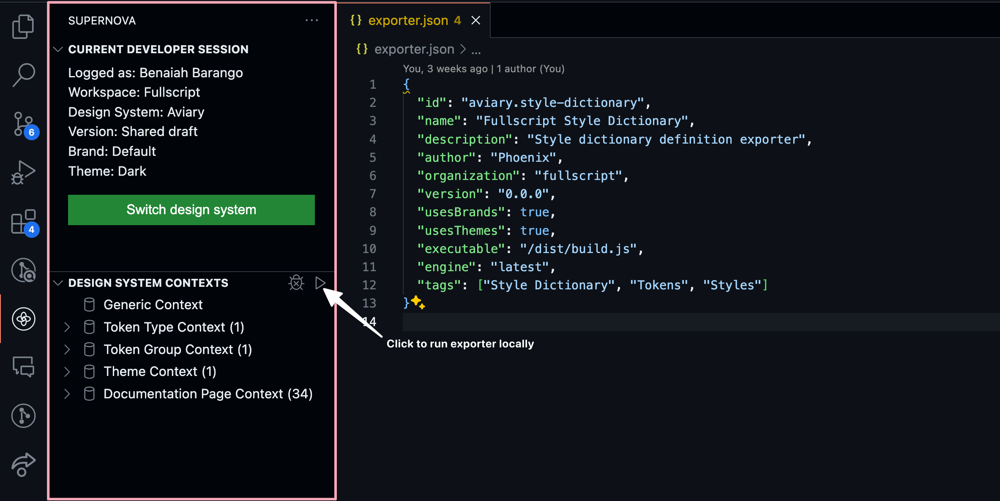

# Aviary Tokens Exporter

This repo handles the export of tokens from [Supernova](https://app.supernova.io/109683-fullscript/114995-aviary/117328-shared-draft/116730-default/tokens/colors) to a Style dictionary (JSON)

## Local Development

To get started, clone this repo and install the dependencies

```bash
git clone ssh://git@repos.fullscript.io:222/developers/aviary-tokens-exporter.git

yarn install
```

You'll need to install the Supernova VSCode Extension following [this guide](https://developers.supernova.io/latest/building-exporters/setup-vs-code-extension-ktcqVU59).

This allows you to access the contents of the design systems directly from the VS Code and can simulate how the exporter will behave when used in the delivery pipelines

Once complete, your Supernova sidebar should look like this



Next, open up a terminal and run `yarn dev` to run the dev server and track any changes you make.

## Example of Output

Given any design system, the exporter will produce CSS color definitions in the following format:

```css
/* This file was automatically generated. Do not modify manually. */

:root {
  /* The reddest of reds */
  --color-red: #ff0000;
  --color-blue: #0000ff;
  /* The main color used throughout the application. */
  --color-primary: var(--color-red);
}
```
